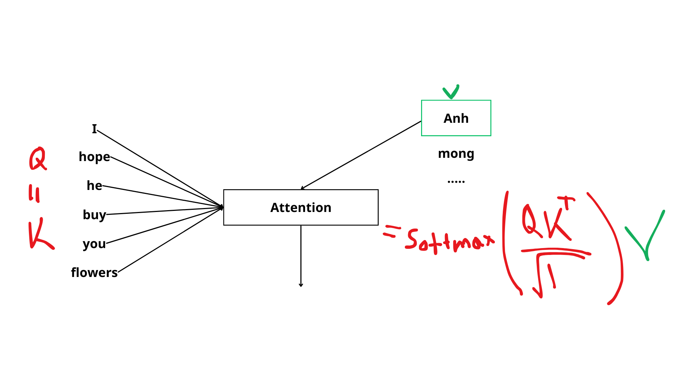
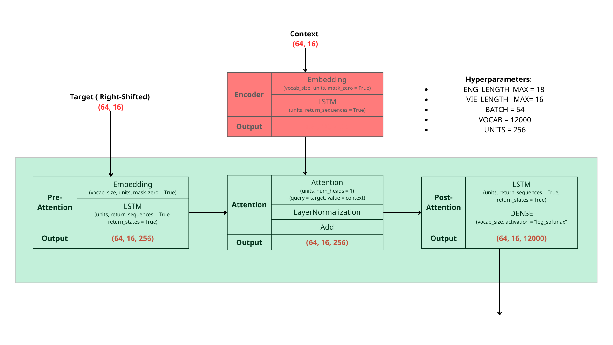

# Translator 
Simple translator from English to Vietnamese 

Just using a vanilla RNN may cause the decoder to focus only on the later parts of the input sequence, which can lead to incorrect predictions.

**Attention helps by allowing the model to consider all words in the input sequence and previous outputs and decide how much each input contributes** to generating the current output.

## Data
- [Tab-delimited Bilingual Sentence Pairs](http://www.manythings.org/anki/)
- [English-Vietnamese translation](https://www.kaggle.com/datasets/hungnm/englishvietnamese-translation)

## Acknowledgement 
This work references directly to the DeepLearning.AI [Natural Language Processing with Attention Models](https://www.coursera.org/learn/attention-models-in-nlp) code
