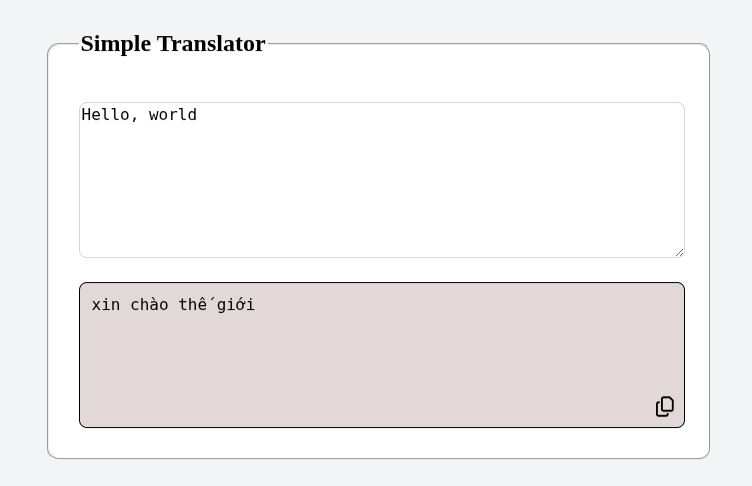

# Translator 
Simple translator from English to Vietnamese. For explaining of attention layer, please visit [How and why can we do translate with attention?](./attention.md) 



## Usage 
You can run the demo by pre-trained model, or can easily finetuned and train it yourself.

For running demo only, **docker is required before run the app**. 
1. Build docker image
    ```bash 
    docker build -t app_image .
    ```
2. Running the image 
   ```bash 
   docker run -p 8000:8000 app_image
   ``` 
3. Just go to any browser then visit `localhost:80000` to get the full demo. The translation will be created in **real-time**. 


### Training 
Create a data folder and put your data in .csv format `data/data.csv`. Where the first column is the context language and the second one is the target translation (separated by a `\t` (tab) delimiter).

Noted that you have to change the name of the column in the notebook `translator.ipynb`

## Data
- [Tab-delimited Bilingual Sentence Pairs](http://www.manythings.org/anki/)
- [English-Vietnamese translation](https://www.kaggle.com/datasets/hungnm/englishvietnamese-translation)

## Acknowledgement 
The model is relatively small and aslo has been trained on a small corpus. So it just **work good with the context of less than 4 words .**

Anyway, all of this work I do just for learning about Attention and FastAPI ML Deployment. It references directly to the DeepLearning.AI [Natural Language Processing with Attention Models](https://www.coursera.org/learn/attention-models-in-nlp) code.
