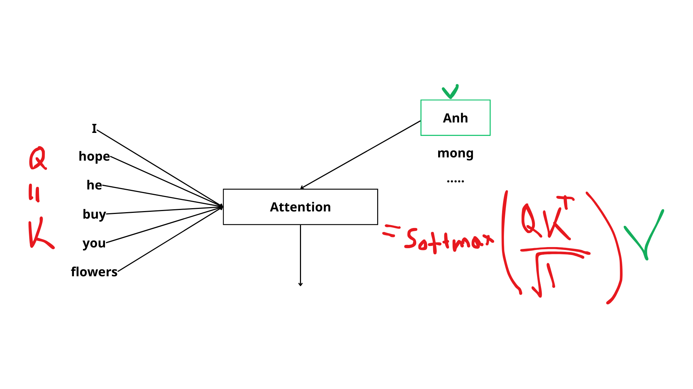

# How and Why We Do Translation with Attention

Let’s explain how we can translate from English to Vietnamese using Deep Learning.

Here’s an example:
- **Context (English)**: "I hope he buys you flowers."
- **Target (Vietnamese)**: "Anh mong rằng anh ấy sẽ mua hoa cho em."

## Encoder-Decoder Architecture

Neural Machine Translation (NMT) and many language tasks use the **Encoder-Decoder** framework. 

- The **Encoder** processes the input sequence and compresses its information into a set of hidden states.
- The **Decoder** uses these hidden states to generate the target sequence.

## Vanilla RNN

The encoder and decoder are often built using RNN variants such as **GRU** or **LSTM**, which help capture sequence patterns. Note that the input and output sequences can have different lengths.

### Encoder
- The input sequence (e.g., English sentence) is passed to the RNN.
- We take the **last hidden state** \( h^{<T>} \) as the summary of the input.

### Decoder
- The decoder starts with:
  - Hidden state \( h^{<0>} = h^{<T>} \) (from the encoder)
  - First input token: `[SOS]` (Start of Sentence)
- The decoder predicts the first word (e.g., “Anh”), then uses that prediction to generate the next word, and so on.

Generation stops when either:
- The model predicts an `[EOS]` (End of Sentence) token
- The output reaches a maximum length threshold \( \tau \)

>  **Limitation of Vanilla RNN**: It compresses the entire input into a single fixed-length vector (last hidden state), which creates an **information bottleneck**, especially with long sentences.

## Attention Mechanism

The attention mechanism improves translation by allowing the decoder to **look at all hidden states from the encoder**, and **assign different weights** to them depending on how relevant they are for predicting each output word.

> Why attention helps:
>
> 1. Using only the last hidden state may overemphasize the last words of the input and ignore the beginning.
> 2. Averaging all hidden states equally doesn’t differentiate important vs. less important parts.
> 3. **Attention assigns learned weights**, letting the decoder focus on the most relevant input tokens at each decoding step.

The following image is an example of how much each target word depend on each context word (from [Explainable AI: Visualizing Attention in Transformers](https://www.comet.com/site/blog/explainable-ai-for-transformers/))

## Final NMT Architecture with Attention

Here’s what the full architecture looks like with attention added:

